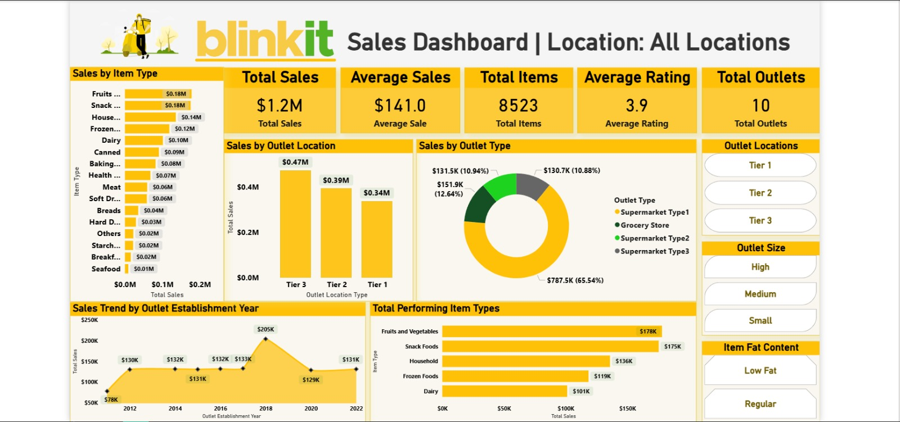

<div align="center">


[](https://git.io/typing-svg)

<br>


<br>

[](https://www.linkedin.com/in/devesh-shukla23)
[](https://github.com/DeveshShukla23)

</div>

---

## 🛒 About This Project
```python
project = {
    "name"      : "Blinkit Sales Dashboard",
    "tool"      : "Power BI Desktop",
    "domain"    : "Retail Analytics — Quick Commerce",
    "company"   : "Blinkit (formerly Grofers) — India's Instant Grocery Delivery",
    "data"      : "10-year sales data (2012–2022)",
    "records"   : "8,523 items across 10 outlets",
    "features"  : ["KPI Cards", "Interactive Slicers", "DAX Measures",
                   "Outlet Analysis", "Category Breakdown", "Sales Trends"],
    "outcome"   : "📊 End-to-end BI Dashboard with actionable business insights"
}
```

> ⚡ *"Turning 10 years of Blinkit grocery data into decisions that drive business growth — outlet by outlet, category by category."*

---

## 📊 Key Metrics

<div align="center">

| 💰 Total Sales | 🛒 Total Items | ⭐ Avg Rating | 🏪 Total Outlets | 📦 Avg Sales/Outlet |
|:---:|:---:|:---:|:---:|:---:|
| **$1.2 Million** | **8,523** | **3.9 / 5** | **10** | **$141.0** |

</div>

---

## 🔍 Dashboard Features
```
✅ Sales by Item Type       — Which product categories generate the most revenue
✅ Sales by Outlet Location — Tier 1 vs Tier 2 vs Tier 3 city performance
✅ Sales by Outlet Type     — Supermarket vs Grocery Store breakdown
✅ Sales Trend (2012–2022)  — 10-year historical sales performance
✅ Top Performing Items     — Fruits, Snacks, Household & more ranked by revenue
✅ Interactive Filters      — Filter by Outlet Size, Location & Fat Content
```

---

## 💡 Key Business Insights
```
🏆  Tier 2 cities lead in total sales at $0.47M — outperforming Tier 1
🛍️  Supermarket Type 1 dominates with 65.54% of total outlet sales
🥦  Fruits & Vegetables and Snack Foods are the top revenue drivers
📈  Sales peaked in 2018 at $205K — strong mid-decade growth
🏪  High-size outlets consistently outperform medium and small outlets
⚡  Low Fat products outsell Regular Fat — health-conscious buying trend
```

---

## 🛠️ Tools & Technologies

<div align="center">

| Tool | Usage |
|:---:|:---:|
| **Power BI Desktop** | Dashboard creation & visualization |
| **DAX** | Custom measures & calculated columns |
| **Power Query** | Data transformation & cleaning |
| **Excel / CSV** | Source data preparation |

</div>

---

## 📸 Dashboard Preview



---

## 💡 Skills Demonstrated

<div align="center">

| Power BI | DAX | Business Intelligence |
|:---:|:---:|:---:|
| ✅ Dashboard Design | ✅ KPI Measures | ✅ Retail Analytics |
| ✅ Interactive Slicers | ✅ Calculated Columns | ✅ Business Insights |
| ✅ Data Modeling | ✅ Time Intelligence | ✅ Outlet Performance |
| ✅ Visual Storytelling | ✅ Conditional Formatting | ✅ Category Analysis |

</div>

---

## 👨‍💻 Author

<div align="center">

**Devesh Shukla**
*Data Analyst | Power BI Developer | Builder*

[](https://www.linkedin.com/in/devesh-shukla23)
[](https://github.com/DeveshShukla23)
[](https://github.com/DeveshShukla23/CHANAKYA)

<br>

⭐ **If you find this useful, please give it a star!** ⭐


</div>
